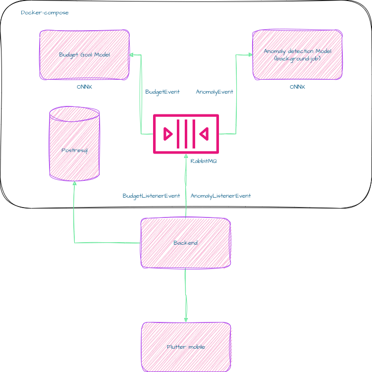

# Trendyol-LLM Multi-Model API

Bu proje, **GPT-Neo 125M fine-tuned** modelini 8 kopya ile çalıştıran bir **multi-container FastAPI servisi** ve **nginx load balancer** örneğidir. Ayrıca memory cache ve semantic similarity ile prompt caching sağlar.

---

## Özellikler

- **8 model container** (her biri bir model kopyası)
- **Nginx round-robin load balancing**
- **FastAPI** tabanlı inference API
- **Memory cache** ile prompt sonuçlarını saklama
- **Semantic similarity**: benzer prompt’lar cache’den yanıt alabilir [TO-DO]
- Tek GPU üzerinde çalışacak şekilde optimize edilmiş
- Docker Compose ile kolay deploy
---

