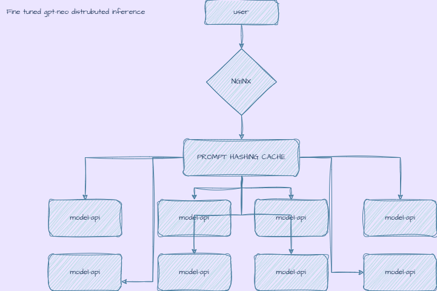

# Trendyol-LLM Multi-Model API

Bu proje, **GPT-Neo 125M fine-tuned** modelini 8 kopya ile çalıştıran bir **multi-container FastAPI servisi** ve **nginx load balancer** örneğidir. Ayrıca memory cache ve semantic similarity ile prompt caching sağlar.

---

## Özellikler

- **8 model container** (her biri bir model kopyası)
- **Nginx round-robin load balancing**
- **FastAPI** tabanlı inference API
- **Memory cache** ile prompt sonuçlarını saklama
- **Semantic similarity**: benzer prompt’lar cache’den yanıt alabilir [TO-DO]
- Tek GPU üzerinde çalışacak şekilde optimize edilmiş
- Docker Compose ile kolay deploy
---

’’’bash 
version: "3.8"

services:

  model_1:

    build: ./model_service

    runtime: nvidia

    environment:

      - NVIDIA_VISIBLE_DEVICES=0

  model_2:

    build: ./model_service

    runtime: nvidia

    environment:

      - NVIDIA_VISIBLE_DEVICES=0

  model_3:

    build: ./model_service

    runtime: nvidia

    environment:

      - NVIDIA_VISIBLE_DEVICES=0

  model_4:

    build: ./model_service

    runtime: nvidia

    environment:

      - NVIDIA_VISIBLE_DEVICES=0

  model_5:

    build: ./model_service

    runtime: nvidia

    environment:

      - NVIDIA_VISIBLE_DEVICES=0

  model_6:

    build: ./model_service

    runtime: nvidia

    environment:

      - NVIDIA_VISIBLE_DEVICES=0

  model_7:

    build: ./model_service

    runtime: nvidia

    environment:

      - NVIDIA_VISIBLE_DEVICES=0

  model_8:

    build: ./model_service

    runtime: nvidia

    environment:

      - NVIDIA_VISIBLE_DEVICES=0

  nginx:

    image: nginx:latest

    ports:

      - "8080:80"

    volumes:

      - ./nginx/nginx.conf:/etc/nginx/nginx.conf:ro

    depends_on:

      - model_1

      - model_2

      - model_3

      - model_4

      - model_5

      - model_6

      - model_7

      - model_8
’’’

